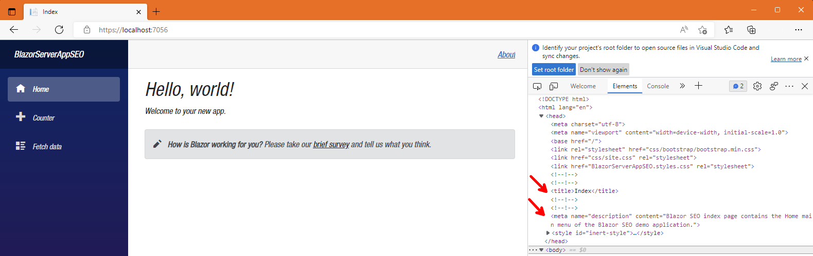
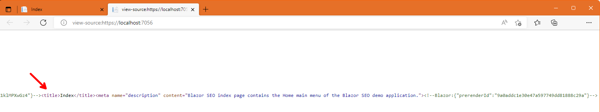
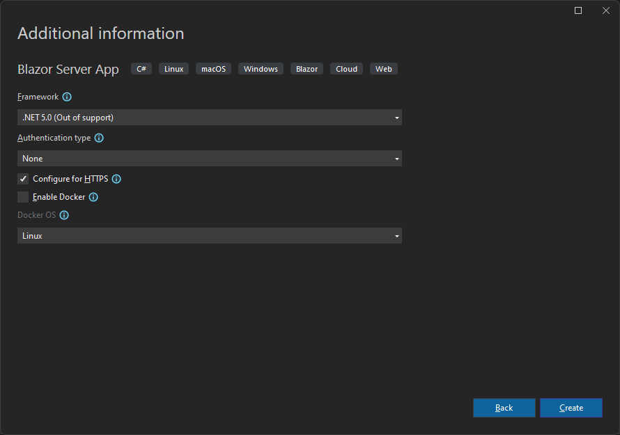

# Table of Contents

- [Table of Contents](#table-of-contents)
  - [Introduction](#introduction)
  - [Prerequisites](#prerequisites)
    - [.NET 6.0](#net-60)
    - [.NET 5.0](#net-50)
    - [Visual Studio 2022 Preview](#visual-studio-2022-preview)
    - [Mobile Development with .NET Workload](#mobile-development-with-net-workload)
  - [Demo](#demo)
    - [Create a Blazor Server Application](#create-a-blazor-server-application)
    - [.NET 6.0 HeadContent and PageTile](#net-60-headcontent-and-pagetile)
      - [*Index.razor* PageTitle](#indexrazor-pagetitle)
      - [*Counter.razor* PageTitle](#counterrazor-pagetitle)
      - [*FetchData.razor* PageTitle](#fetchdatarazor-pagetitle)
      - [*Index.razor* HeadContent](#indexrazor-headcontent)
      - [*Counter.razor* HeadContent](#counterrazor-headcontent)
      - [*FetchData.razor* HeadContent](#fetchdatarazor-headcontent)
    - [SEO in a Blazor Server Application Converted from .NET 5.0 to .NET 6.0](#seo-in-a-blazor-server-application-converted-from-net-50-to-net-60)
      - [*Index.razor* PageTitle and HeadContent](#indexrazor-pagetitle-and-headcontent)
      - [*Counter.razor* PageTitle and HeadContent](#counterrazor-pagetitle-and-headcontent)
      - [*FetchData.razor* PageTitle and HeadContent](#fetchdatarazor-pagetitle-and-headcontent)
    - [Dynamic Title and Meta Tags](#dynamic-title-and-meta-tags)
    - [Create a Blazor WebAssembly Application](#create-a-blazor-webassembly-application)
      - [*Index.razor* PageTitle and HeadContent in WebAssembly](#indexrazor-pagetitle-and-headcontent-in-webassembly)
      - [*Counter.razor* PageTitle and HeadContent in WebAssembly](#counterrazor-pagetitle-and-headcontent-in-webassembly)
      - [*FetchData.razor* PageTitle and HeadContent in WebAssembly](#fetchdatarazor-pagetitle-and-headcontent-in-webassembly)
    - [Prerender a Blazor WebAssembly Application](#prerender-a-blazor-webassembly-application)
    - [SEO Extras](#seo-extras)
  - [Summary](#summary)
  - [Complete Code](#complete-code)
  - [Resources](#resources)

## Introduction

In this episode we will create a Blazor application and I will show you how to make it Search Engine Optimization (SEO) friendly, by leveraging the new `<PageTitle>`, and `<HeadContent>` components introduced in .NET 6.0.

We are going to talk about how `render-mode` `ServerPrerendered` can improve SEO by rendering content for the initial HTTP response, and also I am going to show you how you make changes to a .NET 5.0 Blazor Server application, to take advantage of the new `<PageTitle>`, and `<HeadContent>` components, by upgrading the application to use the .NET 6.0 target framework.

Finally, we will also talk about `render-mode` `ServerPrerendered` in a Blazor WebAssembly application, to also create a SEO-friendly.

End results will have a SEO friendly title and description meta tag, as shown below:


Let's get to it.

## Prerequisites

The following prerequisites are needed for this demo.

### .NET 6.0

Download the latest version of the .NET 6.0 SDK [here](https://dotnet.microsoft.com/en-us/download).

### .NET 5.0

Download the latest version of the .NET 5.0 SDK [here](https://dotnet.microsoft.com/en-us/download/dotnet/5.0).

>:blue_book: The .NET 5.0 is needed only to demonstrate how to implement SEO in a Blazor Server app converted from .NET 5.0 to .NET 6.0.

### Visual Studio 2022 Preview

For this demo, we are going to use the latest version of [Visual Studio 2022 Preview](https://visualstudio.microsoft.com/vs/community/).

### Mobile Development with .NET Workload

In order to build Blazor apps, the ASP.NET and web development workload needs to be installed, so if you do not have that installed let's do that now.


## Demo

Let's get started with the demo by creating a Blazor Server Application.

### Create a Blazor Server Application


As you may know, in order to build a SEO friendly application, we need to provide at a very minimum, a useful title and description for every page. We do this inside the `<head>` section, with the HTML `<title>`, and `<meta>` tags, respectively.

Search engines will use these pieces of information when crawling your pages, and will display them on their search results.

>:blue_book: As I mentioned, title and description, are the minimum items you want to include for SEO, but for a deeper understanding of SEO, refer to the official guidelines for each search engine.  [Search Engine Optimization (SEO) Starter Guide](https://developers.google.com/search/docs/beginner/seo-starter-guide?hl=en&visit_id=637639370449073519-226133402&rd=1), and [Bing Webmaster Guidelines](https://www.bing.com/webmasters/help/webmasters-guidelines-30fba23a).

### .NET 6.0 HeadContent and PageTile

The ability to modify the `<head>` content in Blazor applications was introduced in .NET 6.0 with the addition of the `<PageTitle>`, and `<HeadContent>` components. No longer you have to rely on third party tools or `JSInterop` to modify the `<head>` content.

By default, in a Blazor Server app, a title will be specified for you for the three pages provided by the template `Home` (*Index.razor*), `Counter` (*Counter.razor*), and `Weather forecast` (*FetchData.razor*).

The template does this, by utilizing a `<PageTitle>` component for each page, as you can see in code from the files below:

#### *Index.razor* PageTitle

```razor
<PageTitle>Index</PageTitle>
```

#### *Counter.razor* PageTitle

```razor
<PageTitle>Counter</PageTitle>
```

#### *FetchData.razor* PageTitle

```razor
<PageTitle>Weather forecast</PageTitle>
```

Let's add now a `meta` description to our pages; we do that with the `<HeadContent>` razor component.

Inside of `<HeadContent>` add an `HTML` `<meta>` tag with the name of `description`. Notice that when type `name="` IntelliSense will provide you with a long list of available meta tags you can choose from, as you can see in the following image:


For this example, we need to select or type `description`.

>:blue_book: As you can see there are specific tags for different platforms, such as Apple, Microsoft, Twitter, and Open Graph (og:), used by Facebook. For more information on each platform, check out the resources at the end of this document.

Place a `<HeadContent>` component, with a description meta tag, below `<PageTitle>` in all three files.

#### *Index.razor* HeadContent

```razor
<HeadContent>
    <meta name="description" content="Blazor SEO index page contains the Home main menu of the Blazor SEO demo application." />
</HeadContent>
```

#### *Counter.razor* HeadContent

```razor
<HeadContent>
    <meta name="description" content="Blazor SEO counter page contains a sample counter page in the Blazor SEO demo application." />
</HeadContent>
```

#### *FetchData.razor* HeadContent

```razor
<HeadContent>
    <meta name="description" content="Blazor SEO fetchdata page contains sample Weather Forecast data in the Blazor SEO demo application." />
</HeadContent>
```

Now, let's run the application and see the titles and meta tags in action.



One important thing is to notice that the title and meta tags not only show under the Elements tab in your browser's Dev Tools, but also under the HTML source code which is actually used by the crawler bots. So, to make sure, let's view the HTML source code as well.

Rick-click anywhere on the application, and click on `View page source`.


You will notice that title and description do not show up:


That's because they are "buried" under the `<!--Blazor:...>` comment line below:


Scroll all the way to the right, and you will find the tags, in an uncommented section:



The formatting may change in the future, but the current format is not a problem from web crawlers to find the tags.

>:blue_book: For more information about controlling the head content with `HeadContent` and how this works behind the scenes, refer to this document: [Control \<head> content in ASP.NET Core Blazor apps](https://docs.microsoft.com/en-us/aspnet/core/blazor/components/control-head-content?view=aspnetcore-6.0)

The "magic" that make this possible, is because a Blazor Server app with .NET 6.0 supports prerendering, and to do that, the `App` root component needs to be rendered before the `HeadOutlet`.

If you have a Blazor Server application that was upgraded from .NET 5.0 to .NET 6.0, you need to make a few tweaks to be able to render the `App` root component before the `HeadOutlet`. Let's do that next.

### SEO in a Blazor Server Application Converted from .NET 5.0 to .NET 6.0

Add a new Blazor Server application, but this time select .NET 5.0 as the target framework.




Double-click the project name `BlazorServerAppSEOWithNET5.0`, and change the TargetFramework from net5.0 to net6.0.

Build the application to restore NuGet packages.

An effective way to render the `App` root component before the `HeadOutlet` is to add a *_Layout.cshtml* file, and move some of the content of the *_host.cshtml* there.

Add a new *_Layout.cshtml* file under the *Pages* folder, and add the following code:

```html
@using Microsoft.AspNetCore.Components.Web
@addTagHelper *, Microsoft.AspNetCore.Mvc.TagHelpers

<!DOCTYPE html>
<html lang="en">
<head>
    <meta charset="utf-8" />
    <meta name="viewport" content="width=device-width, initial-scale=1.0" />
    <title>Blazor Server App SEO with NET5.0</title>
    <base href="~/" />
    <link rel="stylesheet" href="css/bootstrap/bootstrap.min.css" />
    <link href="css/site.css" rel="stylesheet" />
    <link href="BlazorServerAppSEOWithNET5.0.styles.css" rel="stylesheet" />
    <component type="typeof(HeadOutlet)" render-mode="ServerPrerendered" />
</head>
<body>
    @RenderBody()

    <script src="_framework/blazor.server.js"></script>
</body>
</html>
```

Remove the code we moved to the *_Layout.cshtml* file from the *_host.cshtml* and make it look like this:

```html
@page "/"
@namespace BlazorServerAppSEOWithNET5._0.Pages
@addTagHelper *, Microsoft.AspNetCore.Mvc.TagHelpers
@{
    Layout = "_Layout";
}

<component type="typeof(App)" render-mode="ServerPrerendered" />
```

That's all the pre-work needed, now we can use `<PageTitle>`, and `<HeadContent>` as we did before.

Add a `<PageTitle>` component with a title, and a `<HeadContent>` component, with a description meta tag in all three files.

#### *Index.razor* PageTitle and HeadContent

```razor
<PageTitle>Index</PageTitle>

<HeadContent>
    <meta name="description" content="Blazor SEO index page contains the Home main menu of the Blazor SEO demo application." />
</HeadContent>
```

#### *Counter.razor* PageTitle and HeadContent

```razor
<PageTitle>Counter</PageTitle>

<HeadContent>
    <meta name="description" content="Blazor SEO counter page contains a sample counter page in the Blazor SEO demo application." />
</HeadContent>
```

#### *FetchData.razor* PageTitle and HeadContent

```razor
<PageTitle>Weather forecast</PageTitle>

<HeadContent>
    <meta name="description" content="Blazor SEO fetchdata page contains sample Weather Forecast data in the Blazor SEO demo application." />
</HeadContent>
```

Set the `BlazorServerAppSEOWithNET5.0` project as the start-up project, and run the application.

As you can see, title and description tags show up correctly under the Elements tab:


As well as under the page source:


### Dynamic Title and Meta Tags

Depending on your application needs, you may choose to create dynamic titles and meta tags for your pages. You can do that either by creating a class with all you pages' hard-coded titles and descriptions, creating them dynamically based on the specific page, think of a Products page, or even retrieving them from a database.

In order to set the values, all you would need to do is to provide the values via code. Take a look at the following basic example:

```razor
<PageTitle>@pageTitle</PageTitle>

<HeadContent>
	<meta name="description" content="@pageDescription">
</HeadContent>

@code {
	private string pageTitle = "Home (Dynamic page title)"
    private string pageDescription = "Description (Dynamic page description.)"
}
```

It would be up to you, to define that class, based on the approach you would like to take for the specific needs of your application. For simplicity, in the example above we are just providing the values via private variables.

### Create a Blazor WebAssembly Application


To be able to use new `<PageTitle>`, and `<HeadContent>` components, we need to add a `HeadOutlet` `RootComponent` into the *Program.cs* file.

The .NET 6.0 Blazor WebAssembly app template does this for us, as you can see it in the *Program.cs* file:

```csharp
builder.RootComponents.Add<HeadOutlet>("head::after");
```

>:blue_book: If you are converting a .NET 5.0 Blazor WebAssembly Application into .NET 6.0, like we did before, adding the line above to your *Program.cs* file is all you have to do.

Now you can add a `<PageTitle>` component with a title, and a `<HeadContent>` component, with a description meta tag in all three files.

#### *Index.razor* PageTitle and HeadContent in WebAssembly

```razor
<PageTitle>Index</PageTitle>

<HeadContent>
    <meta name="description" content="Blazor SEO index page contains the Home main menu of the Blazor SEO demo application." />
</HeadContent>
```

#### *Counter.razor* PageTitle and HeadContent in WebAssembly

```razor
<PageTitle>Counter</PageTitle>

<HeadContent>
    <meta name="description" content="Blazor SEO counter page contains a sample counter page in the Blazor SEO demo application." />
</HeadContent>
```

#### *FetchData.razor* PageTitle and HeadContent in WebAssembly

```razor
<PageTitle>Weather forecast</PageTitle>

<HeadContent>
    <meta name="description" content="Blazor SEO fetchdata page contains sample Weather Forecast data in the Blazor SEO demo application." />
</HeadContent>
```

For Blazor WebAssembly applications, that is not the end of the story. Even though, we are able to use the `<PageTitle>`, and `<HeadContent>` components, we still have more work to do.

Inspecting the Elements tab in the browser's development tools will show the title and description meta tag:

  

However, if we view the page source, we will not see the correct title, we will see `BlazorWebAssemblyAppSEO` instead of `Index`, and description will not show at all, which is not good for SEO, as web crawlers will inspect the HTML source code:

  

So, what's going on here?

Well, for starters, the titles of all three pages are being set by the *index.html* under the *wwwroot* folder. Titles and descriptions are not being properly set by the `<PageTitle>`, and `<HeadContent>` components.

The issue, is because our Blazor WebAssembly is not being prerendered.

How can we make a Blazor WebAssembly application take advantage of `ServerPrerendered` to aid with SEO?

### Prerender a Blazor WebAssembly Application

The good news is that `render-mode` `ServerPrerendered` in a Blazor WebAssembly Application is possible, although, it is actually called `WebAssemblyPrerendered` and not `ServerPrerendered`. The "bad" news is that it requires you to host your Blazor WebAssembly application in an ASP.NET Core app, and it requires many steps to make it happen.

In short, you can host your Blazor WebAssembly in an ASP.NET Core app, by checking the appropriate box when creating a Blazor WebAssembly application:

  

But, you still have to make several changes to make it a SEO-friendly application.

Rather than trying to replicate, in this demo, the steps needed to make our Blazor WebAssembly app a SEO-friendly application, I will redirect you to a very well-documented and step-by-step document as outlined by Microsoft.

I am talking about [Prerender and integrate ASP.NET Core Razor components](https://docs.microsoft.com/en-us/aspnet/core/blazor/components/prerendering-and-integration?view=aspnetcore-6.0&pivots=webassembly).

Take notice that the document also explains how to make use of the new `PersistentComponentState` which without it, the state used during prerendering will get lost, and it will have to be recreated once the application is fully loaded. This is particularly true when making asynchronously calls, and a consequence of that would be that the application may flicker as the prerendered UI is replaced with temporarily placeholders and then rendered again. Use the `PersistentComponentState` class to fix that problem.

### SEO Extras

SEO is a big topic, and there are several techniques to help with better index your pages by the web search engines. Below I list a few extras that can help with SEO.

- Besides the title and description, the `H1` tag on each page, also play an important role in SEO, so make sure you keep a `H1` tag on your pages, as it will be use in the browser's results top-level heading.
- There are restrictions as how long title, description and `H1` headers can be, so make sure you visit each search engine's official documentation.
- Create a *sitemap.xml* which is basically a file that contains a list of the pages on your site, among other information.
- Back in the day, the `keywords` meta data used to be considered for SEO, and we would add a comma-separate list of keywords relevant to your page. That is no longer the case, so do not bother adding `keywords` meta data.

## Summary

In this episode we showed you how to utilize the new `<PageTitle>`, and `<HeadContent>` components, introduced in .NET 6.0, to make SEO-friendly applications in both Blazor Server and Blazor WebAssembly.

We also talked about how `render-mode` `ServerPrerendered` aids with SEO, and how you can upgrade a .NET 5.0 Blazor Server application to .NET 6.0, and by making small changes utilize the `<PageTitle>`, and `<HeadContent>` components.

Finally, we also talked about `ServerPrerendered` in Blazor WebAssembly applications, to make it SEO-friendly as well.

For more information about Blazor and SEO, check out the links in the resources section below.

## Complete Code

The complete code for this demo can be found in the link below.

- <https://github.com/payini/BlazorSEO>

## Resources

| Resource Title                                        | Url                                                                                                                                  |
| ----------------------------------------------------- | ------------------------------------------------------------------------------------------------------------------------------------ |
| The .NET Show with Carl Franklin                      | <https://www.youtube.com/playlist?list=PL8h4jt35t1wgW_PqzZ9USrHvvnk8JMQy_>                                                           |
| Download .NET                                         | <https://dotnet.microsoft.com/en-us/download>                                                                                        |
| Prerender and integrate ASP.NET Core Razor components | <https://docs.microsoft.com/en-us/aspnet/core/blazor/components/prerendering-and-integration?view=aspnetcore-6.0&pivots=webassembly> |
| Search Engine Optimization (SEO) Starter Guide        | <https://developers.google.com/search/docs/beginner/seo-starter-guide?hl=en&visit_id=637639370449073519-226133402&rd=1>              |
| Bing Webmaster Guidelines                             | <https://www.bing.com/webmasters/help/webmasters-guidelines-30fba23a>                                                                |
| Control \<head> content in ASP.NET Core Blazor apps   | <https://docs.microsoft.com/en-us/aspnet/core/blazor/components/control-head-content?view=aspnetcore-6.0>                            |
| Apple Supported Meta Tags                             | https://developer.apple.com/library/archive/documentation/AppleApplications/Reference/SafariHTMLRef/Articles/MetaTags.html           |

|Twitter Cards|<https://developer.twitter.com/en/docs/twitter-for-websites/cards/guides/getting-started>|
|https://developer.twitter.com/en/docs/twitter-for-websites/cards/guides/getting-started|https://ogp.me/|
